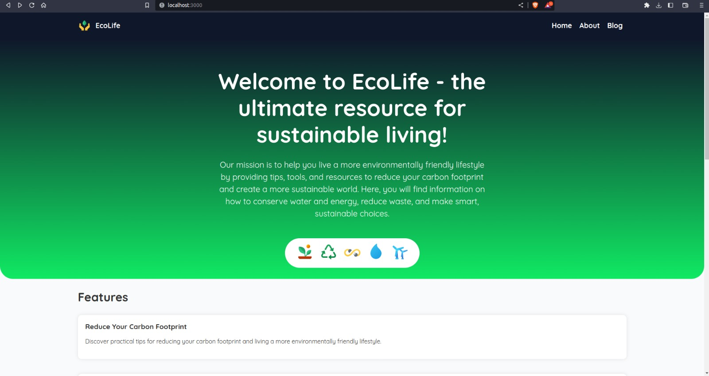
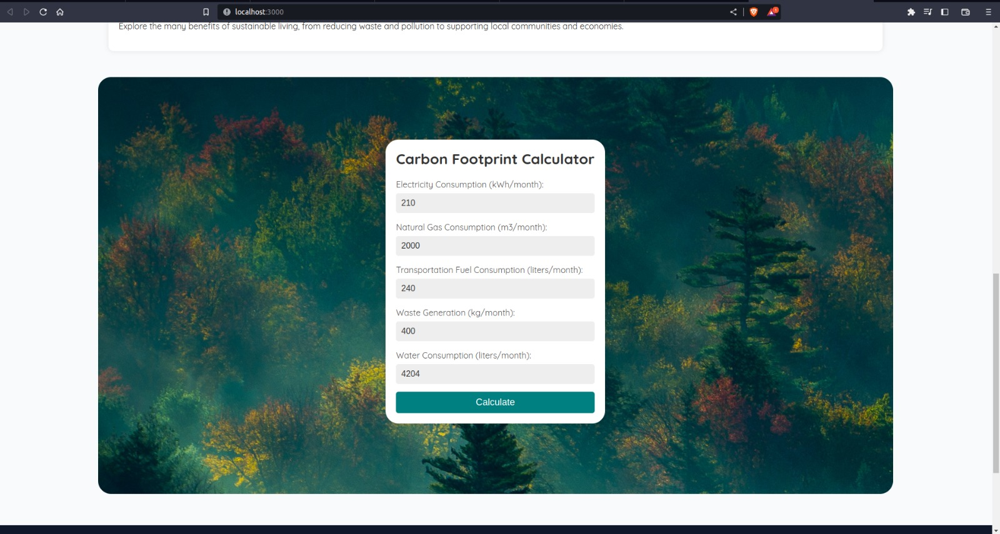

<h1 align="center"> EcoLife 🪴 </h1>

#### EcoLife is a sustainable living website that I built as a project while learning Astro and as a part of my college project. It provides information and resources on reducing carbon footprint, conserving energy and water, reducing waste, and living a more eco-friendly lifestyle. It includes a carbon footprint calculator too.

## Tech used: 

## Screenshot:

